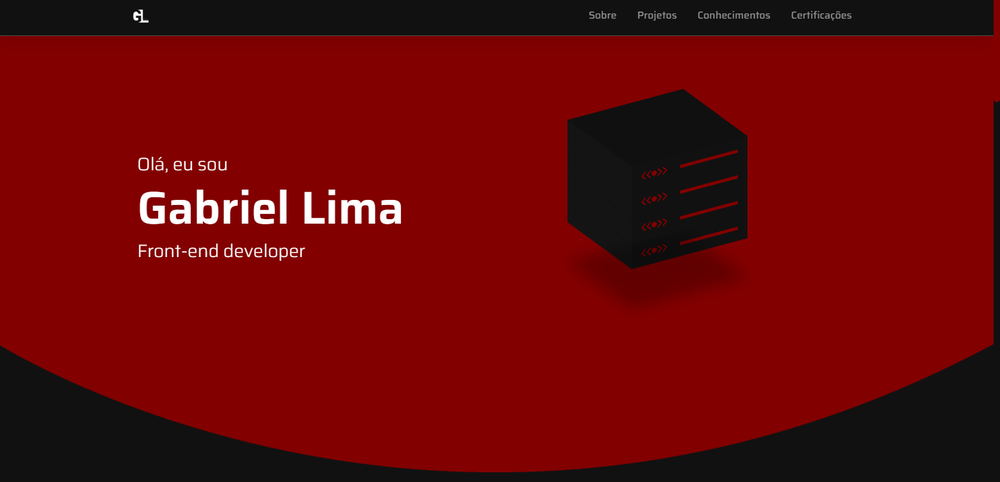

# 💻 Portfólio - Gabriel Lima

<h4 align="center"><a href="https://gabriellimmaa.github.io/portifolio/">Clique para visitar o projeto</a></h4>

---
## 📚 Seções
O site é composto por cinco seções:
- **Home:** Tela de apresentação do site;
- **Quem sou:** Nessa seção tenho uma descrição dizendo um pouco sobre quem sou;
- **Projetos:** Apresenta alguns projetos desenvolvidos e com link direto para as respectivas aplicações;
- **Conhecimentos:** Nele apresentamos meus conhecimentos em algumas linguagens com o foco no front-end;
- **Certificações:** Exibe todos os meus certificados relacionado a cursos ou eventos, também podemos observar algumas informações a mais.
---
## 🛠️ Construído com
Para o desenvolvimento deste site utilizei as seguintes tecnologias:
- HTML;
- CSS;
- JavaScript;
- Bootstrap;
- Swiper;
---
## ✒️ Autor

<table>
  <tr>
    <td align="center">
      <a href="https://github.com/Gabriellimmaa">
         
        
          <b>Iuri Silva</b>
        
      </a>
    </td>
  </tr>
</table>

---

Obrigado por me ceder seu tempo lendo sobre o meu trabalho.

Qualquer dúvida, crítica ou sugestão entre em <a href="mailto:gabriellimamoraes@gmail.com/">contato</a> pelo meu e-mail
